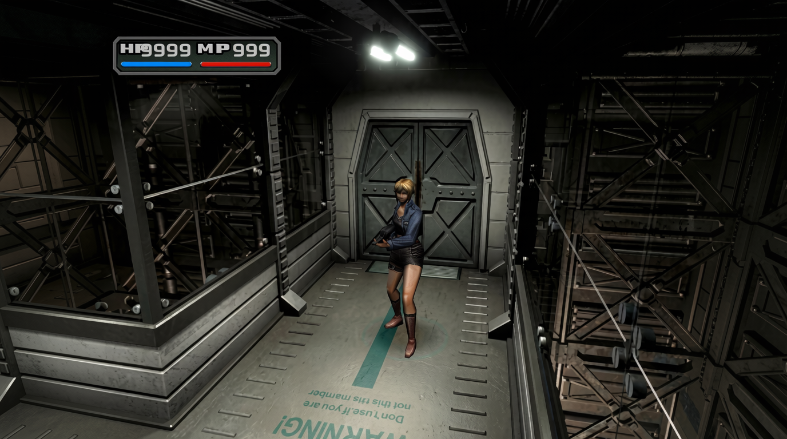

  

  <b>Una versión nativa para PC de Parasite Eve II, reconstruida a partir del juego original de PlayStation y remasterizada en alta definición.</b>

  
  
  

  <a href="README.md">🇬🇧 Read in English</a>

---

## Sobre el proyecto

**Parasite Eve II HD Remaster** trae el clásico survival horror de Square del año 2000 a los PC actuales.

**No es un emulador.** El código original del juego de PlayStation se ha recompilado estáticamente en un ejecutable
nativo de Windows, lo que permite mejorar el juego desde dentro: modelos 3D nítidos, geometría estable, fondos
prerrenderizados en alta resolución y un pack de texturas completamente remasterizado.

Este repositorio es la **casa pública del proyecto**: novedades, capturas y progreso. No contiene código fuente,
ejecutables ni datos del juego.

> ⭐ Dale una **estrella** y pulsa 👁️ **Watch** para seguir el desarrollo.

---

## Capturas

<table>
  <tr>
    <td></td>
    <td></td>
    <td></td>
  </tr>
  <tr>
    <td></td>
    <td></td>
    <td></td>
  </tr>
  <tr>
    <td></td>
    <td></td>
    <td></td>
  </tr>
</table>

## Antes y después

<table>
  <tr>
    <td align="center"> <b>Fondos</b></td>
    <td align="center"> <b>Personajes</b></td>
  </tr>
  <tr>
    <td align="center"> <b>Menús y HUD</b></td>
    <td align="center"> <b>Geometría (PGXP)</b></td>
  </tr>
</table>

---

## Características

### 🖥️ Versión nativa para PC
- **Recompilación estática** del juego original en un ejecutable nativo de Windows. Sin emulador.
- **Renderizado a alta resolución interna** para modelos 3D nítidos.
- **Precisión de geometría PGXP**: se acabaron los polígonos que tiemblan y las texturas que se deforman, y un
  recorte de polígonos preciso para que los personajes lejanos no pierdan triángulos.
- **Juego a 60 FPS** (experimental): la lógica sigue a sus 30 FPS originales, pero el renderizador compone un
  fotograma intermedio con cada polígono 3D a medio camino entre dos fotogramas del juego. Personajes y enemigos se
  mueven a 60 FPS sin retraso añadido; texto, HUD, vídeos y cambios de cámara quedan intactos.

### 🇪🇸 Localización completa al castellano
- El disco ya tenía los diálogos en castellano; las **etiquetas de los menús** (Item, Status, Key Item, Equip...) y las
  **fichas de armas, munición y protecciones** que seguían en inglés están ahora traducidas, sin modificar el disco.

### 🎮 Opciones y comodidad
- **Mejoras de comodidad**: sin destello al empezar el combate, cierre automático de los resultados del combate,
  desenfundado rápido, munición visible fuera de combate y más.
- **Trucos clásicos de GameShark** (salud infinita, munición, todos los objetos clave, niveles de Parasite Energy,
  trajes...) adaptados a esta versión y activables desde el lanzador.
- **Teletransporte de salas (debug)**: elige cualquier stage y sala en un selector en pantalla y salta a ella por
  cualquier puerta.

### 🎨 Remasterización HD
- **Fondos prerrenderizados en HD** a 1440×1080, incluidos los que se cargan por tiras durante las escenas del juego.
- **Los cuadros de texto y las transiciones de puertas se mantienen en HD.** El juego original congelaba la pantalla a
  320×240 cada vez que aparecía un mensaje; la remasterización conserva la resolución completa.
- **Capas de primer plano en HD** generadas a partir de los fondos HD, para que los objetos delante de los personajes
  coincidan con el nuevo arte.
- **Texturas remasterizadas** de personajes, enemigos, armas, HUD y menús.
- **Compatible con packs de texturas de DuckStation**: los reemplazos `texpage-*` y `vram-write-*` funcionan tal cual.
- **Pensado para quien hace texturas**: los reemplazos se llaman como los ficheros del propio juego (fondos
  `bs_N.png`, imágenes `pe2img_N.png`), el pack **se recarga con el juego abierto** (guardas un PNG y lo ves al
  instante), y una galería en color de todas las imágenes del disco más una herramienta que identifica los volcados de
  DuckStation llevan la cuenta de lo hecho, lo que está en proceso y lo que falta.

---

## Hoja de ruta

| Estado | Característica |
|:---:|---|
| ✅ | Ejecutable nativo de Windows (recompilación estática) |
| ✅ | Renderizado a alta resolución y precisión de geometría PGXP |
| ✅ | Motor de reemplazo de fondos HD |
| ✅ | Cuadros de texto y pantallas congeladas en HD |
| ✅ | Motor de reemplazo de texturas HD (por imagen del juego, por paleta, compatible con DuckStation) |
| ✅ | Capas de primer plano HD automáticas |
| ✅ | Juego a **60 FPS** por interpolación de polígonos (experimental) |
| ✅ | Recorte de polígonos preciso (PGXP) |
| ✅ | Localización completa al castellano (menús y fichas de objetos) |
| ✅ | Opciones de comodidad, trucos y teletransporte de salas |
| ✅ | Recarga en caliente del pack HD y texturas con nombres del disco |
| 🚧 | Completar el pack de fondos HD |
| 🚧 | Personajes, enemigos y armas remasterizados |
| 🚧 | HUD, menús e iconos de objetos remasterizados |
| 🔜 | **Pantalla panorámica nativa (16:9)** |
| 🔜 | **FMV mejorados** en alta resolución |
| 🔜 | Lanzamiento público |

### Progreso del pack HD

| Recurso | Remasterizados | Total | Progreso |
|---|---:|---:|---|
| Fondos prerrenderizados | 1.328 | 1.759 |  |
| Imágenes del juego (personajes, HUD, menús, primeros planos) | 864 | 1.453 |  |

---

## Novedades

**14-09-2026 — 60 FPS, recorte preciso, menús en castellano y herramientas**
- **Juego a 60 FPS** (experimental). Forzar el juego a 60 lo ponía al doble de velocidad, así que el renderizador graba
  todos los polígonos de cada fotograma y compone uno intermedio con la geometría 3D a medio camino entre dos
  fotogramas. Empareja los polígonos por sus coordenadas de textura, deja quietos el texto y el UI, y se desactiva solo
  en cambios de cámara, cargas, pantallas congeladas y vídeos. Sin retraso añadido en los mandos.
- **Recorte preciso**: los personajes lejanos perdían triángulos porque la PlayStation decide la visibilidad con
  coordenadas enteras. El GTE conserva ahora la precisión subpíxel a través de las recargas de vértices del propio
  juego, y cada decisión de recorte se toma con ella.
- **Menús y fichas en castellano**: las últimas cadenas en inglés (etiquetas de menú, fichas de munición y
  protecciones) se traducen en memoria y al vuelo cuando se leen del disco, sin tocar los ficheros del juego.
- **Trucos y comodidad**: 25 códigos GameShark adaptados a esta versión, más "sin destello al empezar el combate",
  "cierre automático de resultados", desenfundado rápido, munición fuera de combate y un teletransporte de salas.
- **Para quien hace texturas**: el pack HD se divide ahora en *final*, *en proceso* y *faltantes*, los ficheros usan
  los nombres del disco y el juego recarga cualquier PNG en cuanto se guarda.

---

## Próximamente: pantalla panorámica

  

El objetivo es un **modo 16:9 nativo** que muestre más de cada escena en lugar de estirar la imagen 4:3.
Los fondos prerrenderizados se ampliarán para rellenar la vista más ancha.

---

## Preguntas frecuentes

**¿Se puede descargar?**
Todavía no. El proyecto está en desarrollo activo. Sigue este repositorio para enterarte del primer lanzamiento.

**¿Necesitaré el juego original?**
Sí. Necesitarás tu propia copia legal de *Parasite Eve II* para PlayStation. Nunca se distribuirán datos del juego.

**¿Es un emulador?**
No. El código del juego se ejecuta de forma nativa en tu PC tras recompilarse a partir del ejecutable original de PlayStation.

**¿Está disponible el código fuente?**
Por ahora no.

---

## Créditos

Este proyecto se apoya en estos proyectos y personas increíbles:

| Proyecto | Autor | Para qué se usa | Licencia |
|---|---|---|---|
| [PSXRecomp](https://github.com/mstan/psxrecomp) | Matthew Stan | El recompilador estático de PlayStation y el runtime fiel al hardware sobre el que se construye esta versión | PolyForm Noncommercial 1.0.0 |
| [Descompilación de Parasite Eve II](https://github.com/GabeRealB/parasite-eve-2-decomp) | GabeRealB y colaboradores | Formatos de archivo del juego, herramientas de extracción, símbolos y nombres de salas | CC0 1.0 |
| [DuckStation](https://github.com/stenzek/duckstation) | Stenzek | Referencia para los nombres de reemplazo de texturas y la decodificación MDEC, para que los packs de DuckStation funcionen tal cual | CC BY-NC-ND 4.0 |
| [Beetle PSX](https://github.com/libretro/beetle-psx-libretro) | libretro, basado en Mednafen | Referencia de precisión usada por PSXRecomp | GPL-2.0 |
| PGXP | iCatButler | Técnica original de precisión de geometría | — |
| [PlayStation Specifications (psx-spx)](https://psx-spx.consoledev.net/) | Martin "nocash" Korth y colaboradores | Documentación del hardware y de los contenedores de archivos | — |

Librerías: [SDL3](https://libsdl.org), [xxHash](https://github.com/Cyan4973/xxHash) (Yann Collet),
[stb_image](https://github.com/nothings/stb) (Sean Barrett), [libchdr](https://github.com/rtissera/libchdr) y [zlib](https://zlib.net).

Pack HD Remaster y proyecto: **faligame**.

---

## Aviso legal

Este es un proyecto fan sin ánimo de lucro y no está afiliado, respaldado ni patrocinado por Square Enix.
*Parasite Eve* y *Parasite Eve II* son marcas registradas de Square Enix Co., Ltd. Todo el contenido del juego pertenece a sus respectivos propietarios.
Este repositorio no contiene ni distribuirá nunca archivos del juego, BIOS ni recursos del juego protegidos por derechos de autor.
