

  

  <b>Una versión nativa para PC de Parasite Eve II, reconstruida a partir del juego original de PlayStation y remasterizada en alta definición.</b>

  
  
  

  <a href="README.md">🇬🇧 Read in English</a>

---

## Sobre el proyecto

**Parasite Eve II HD Remaster** trae el clásico survival horror de Square del año 2000 a los PC actuales.

**No es un emulador.** El código original del juego de PlayStation se ha recompilado estáticamente en un ejecutable
nativo de Windows, lo que permite mejorar el juego desde dentro: modelos 3D nítidos, geometría estable, fondos
prerrenderizados en alta resolución y un pack de texturas completamente remasterizado.

Este repositorio es la **casa pública del proyecto**: novedades, capturas y progreso. No contiene código fuente,
ejecutables ni datos del juego.

> ⭐ Dale una **estrella** y pulsa 👁️ **Watch** para seguir el desarrollo.

---

## Capturas

<table>
  <tr>
    <td>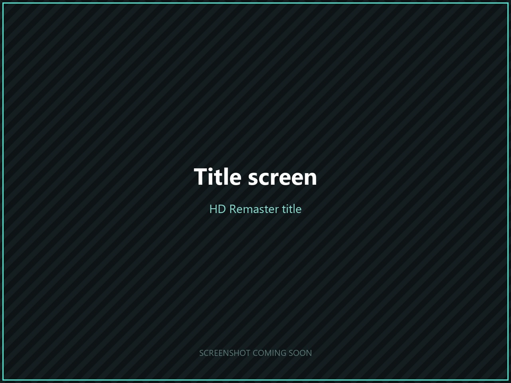</td>
    <td>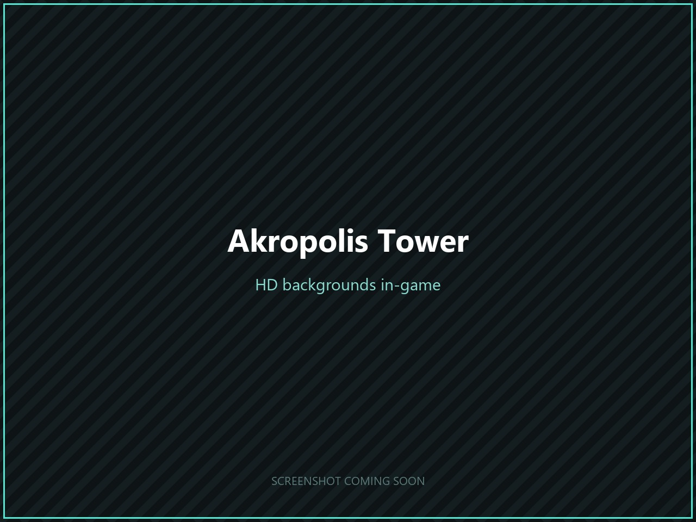</td>
    <td>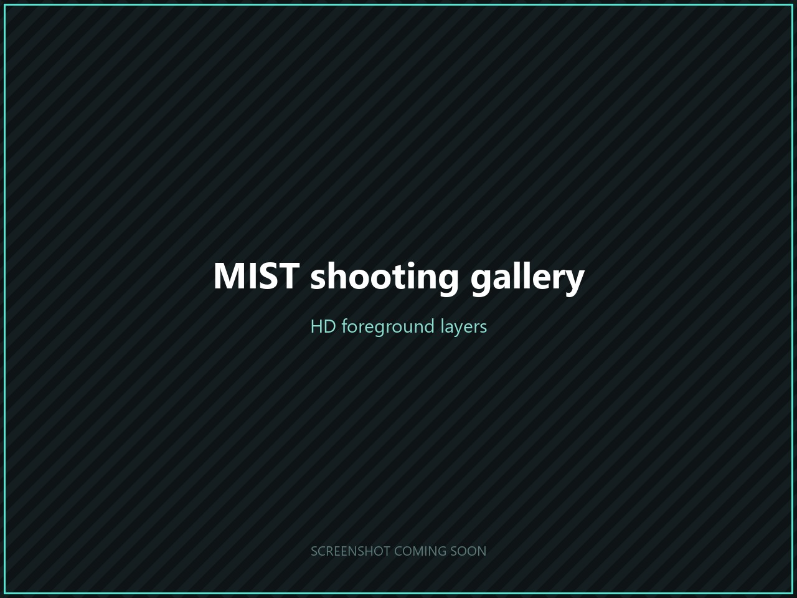</td>
  </tr>
  <tr>
    <td>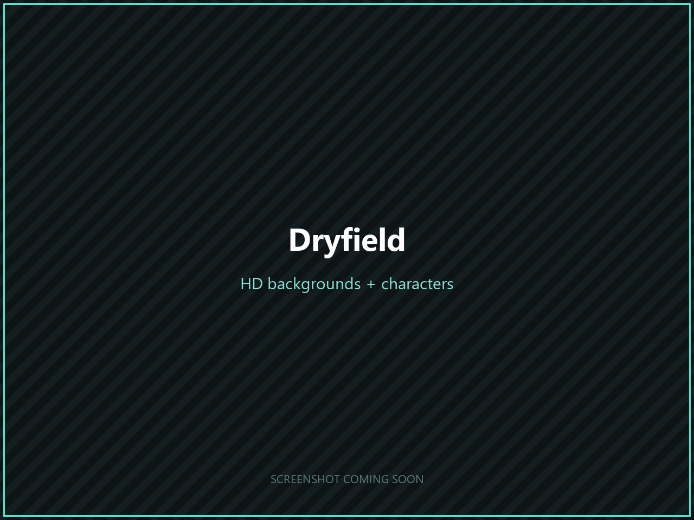</td>
    <td>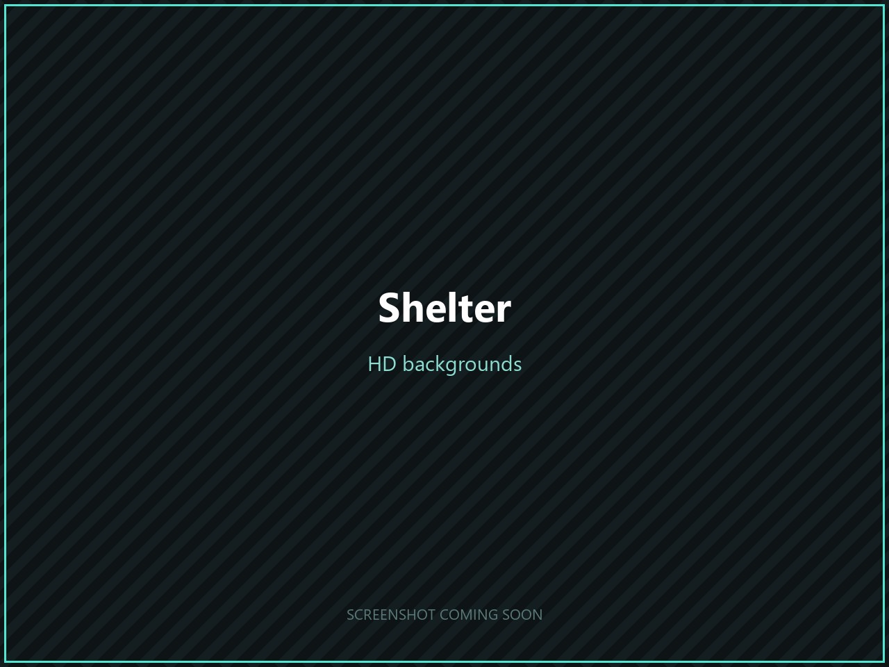</td>
    <td>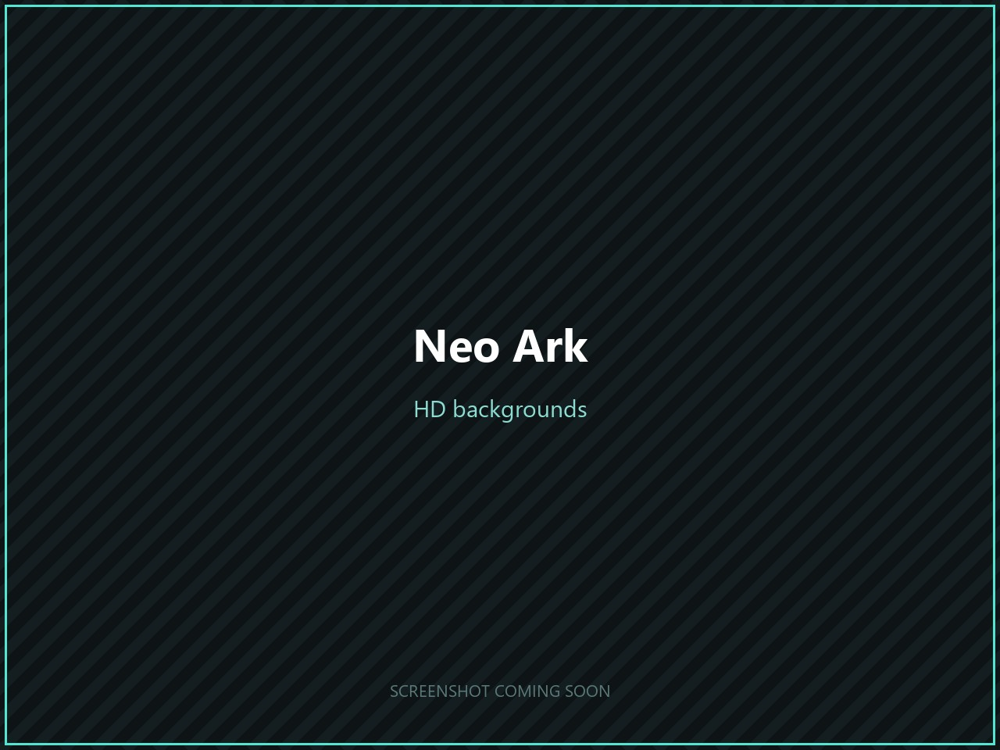</td>
  </tr>
  <tr>
    <td>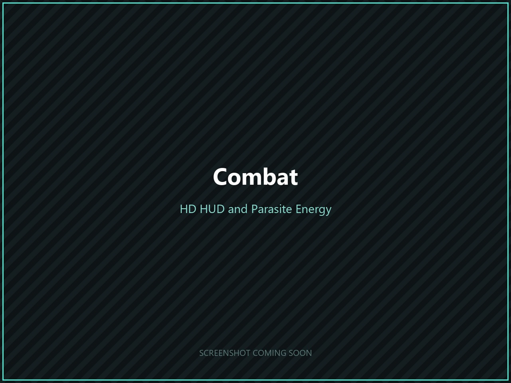</td>
    <td>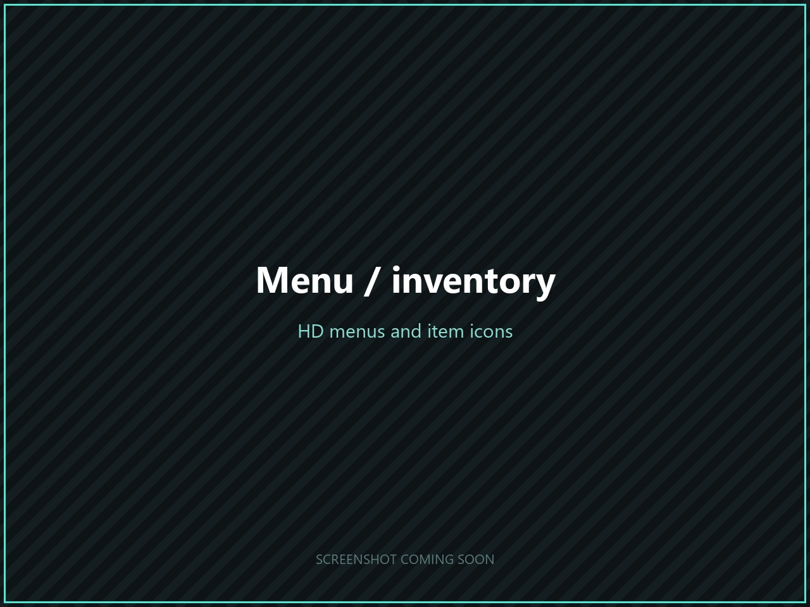</td>
    <td>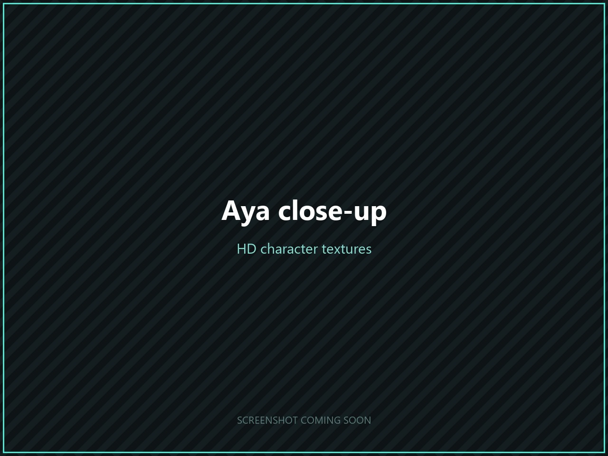</td>
  </tr>
</table>

## Antes y después

  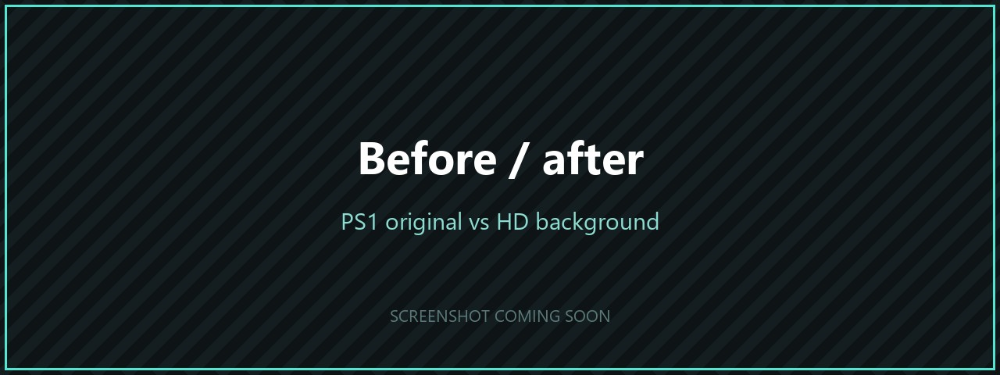 
  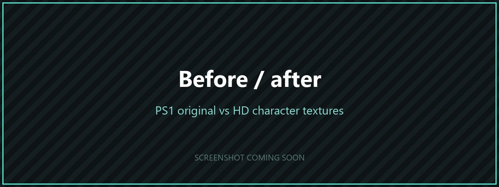 
  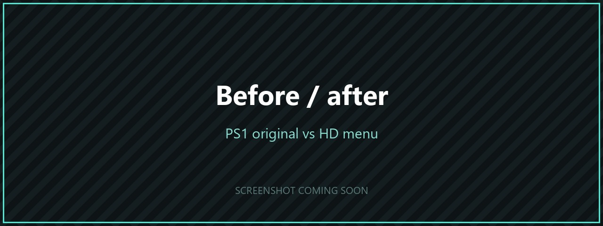 
  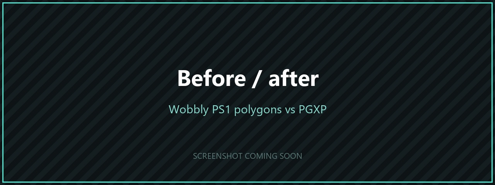

---

## Características

### 🖥️ Versión nativa para PC
- **Recompilación estática** del juego original en un ejecutable nativo de Windows. Sin emulador.
- **Renderizado a alta resolución interna** para modelos 3D nítidos.
- **Precisión de geometría PGXP**: se acabaron los polígonos que tiemblan y las texturas que se deforman.
- Salida a **60 Hz** con el juego original a **30 FPS**. **60 FPS próximamente.**

### 🎨 Remasterización HD
- **Fondos prerrenderizados en HD** a 1440×1080, incluidos los que se cargan por tiras durante las escenas del juego.
- **Los cuadros de texto y las transiciones de puertas se mantienen en HD.** El juego original congelaba la pantalla a
  320×240 cada vez que aparecía un mensaje; la remasterización conserva la resolución completa.
- **Capas de primer plano en HD** generadas a partir de los fondos HD, para que los objetos delante de los personajes
  coincidan con el nuevo arte.
- **Texturas remasterizadas** de personajes, enemigos, armas, HUD y menús.
- **Compatible con packs de texturas de DuckStation**: los reemplazos `texpage-*` y `vram-write-*` funcionan tal cual.

---

## Hoja de ruta

| Estado | Característica |
|:---:|---|
| ✅ | Ejecutable nativo de Windows (recompilación estática) |
| ✅ | Renderizado a alta resolución y precisión de geometría PGXP |
| ✅ | Motor de reemplazo de fondos HD |
| ✅ | Cuadros de texto y pantallas congeladas en HD |
| ✅ | Motor de reemplazo de texturas HD (por imagen del juego, por paleta, compatible con DuckStation) |
| ✅ | Capas de primer plano HD automáticas |
| 🚧 | Completar el pack de fondos HD |
| 🚧 | Personajes, enemigos y armas remasterizados |
| 🚧 | HUD, menús e iconos de objetos remasterizados |
| 🔜 | Juego a **60 FPS** |
| 🔜 | **Pantalla panorámica nativa (16:9)** |
| 🔜 | **FMV mejorados** en alta resolución |
| 🔜 | Lanzamiento público |

### Progreso del pack HD

| Recurso | Remasterizados | Total | Progreso |
|---|---:|---:|---|
| Fondos prerrenderizados | 1.328 | 1.759 |  |
| Imágenes del juego (personajes, HUD, menús, primeros planos) | 864 | 1.453 |  |

---

## Próximamente: pantalla panorámica

  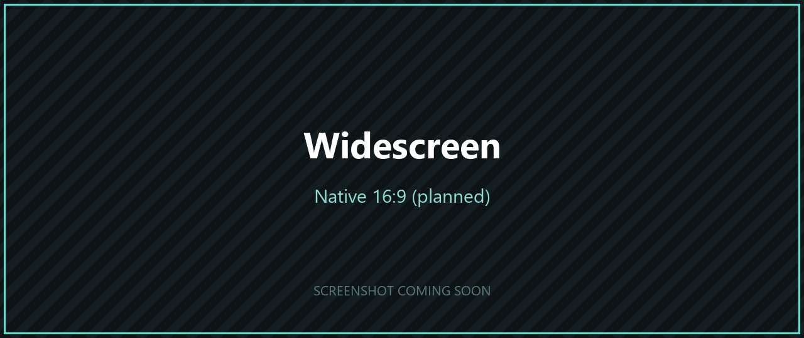

El objetivo es un **modo 16:9 nativo** que muestre más de cada escena en lugar de estirar la imagen 4:3.
Los fondos prerrenderizados se ampliarán para rellenar la vista más ancha.

---

## Preguntas frecuentes

**¿Se puede descargar?**
Todavía no. El proyecto está en desarrollo activo. Sigue este repositorio para enterarte del primer lanzamiento.

**¿Necesitaré el juego original?**
Sí. Necesitarás tu propia copia legal de *Parasite Eve II* para PlayStation. Nunca se distribuirán datos del juego.

**¿Es un emulador?**
No. El código del juego se ejecuta de forma nativa en tu PC tras recompilarse a partir del ejecutable original de PlayStation.

**¿Está disponible el código fuente?**
Por ahora no.

---

## Aviso legal

Este es un proyecto fan sin ánimo de lucro y no está afiliado, respaldado ni patrocinado por Square Enix.
*Parasite Eve* y *Parasite Eve II* son marcas registradas de Square Enix Co., Ltd. Todo el contenido del juego pertenece a sus respectivos propietarios.
Este repositorio no contiene ni distribuirá nunca archivos del juego, BIOS ni recursos del juego protegidos por derechos de autor.
