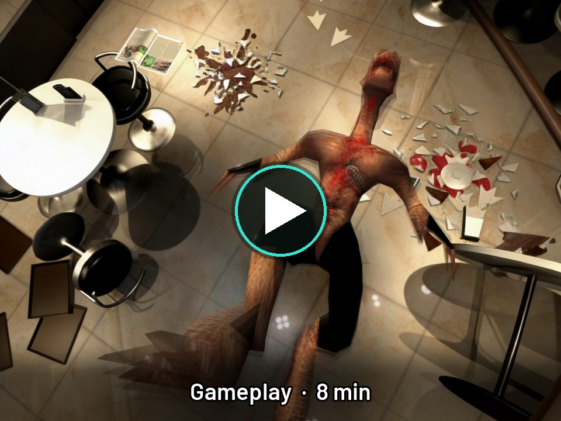
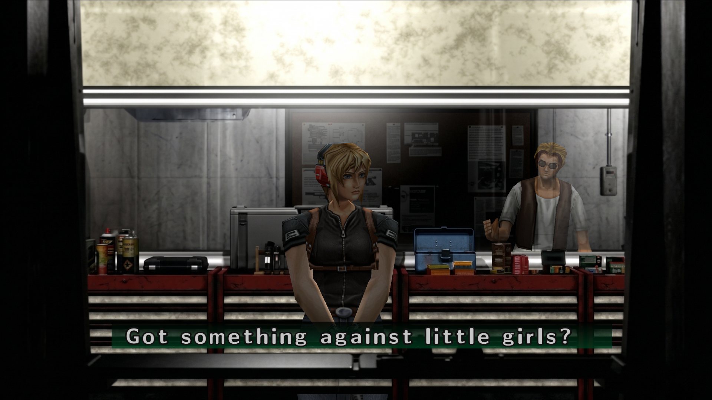
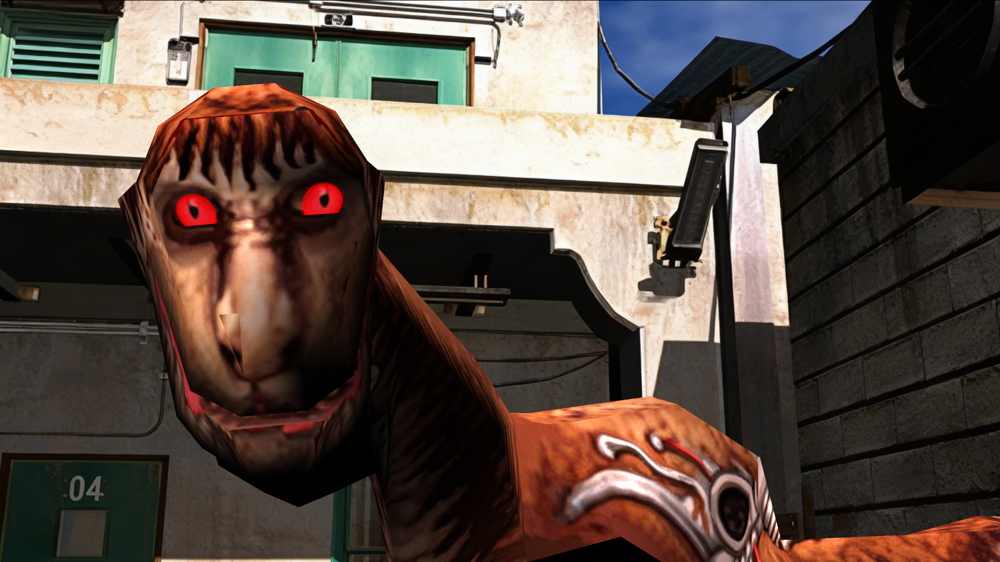
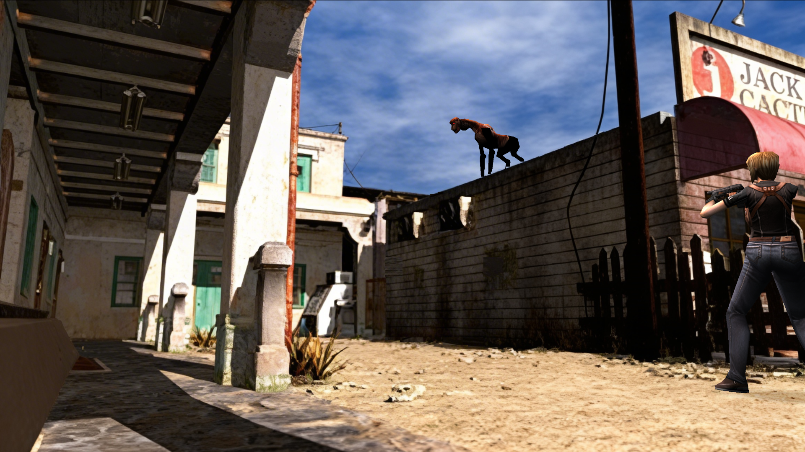
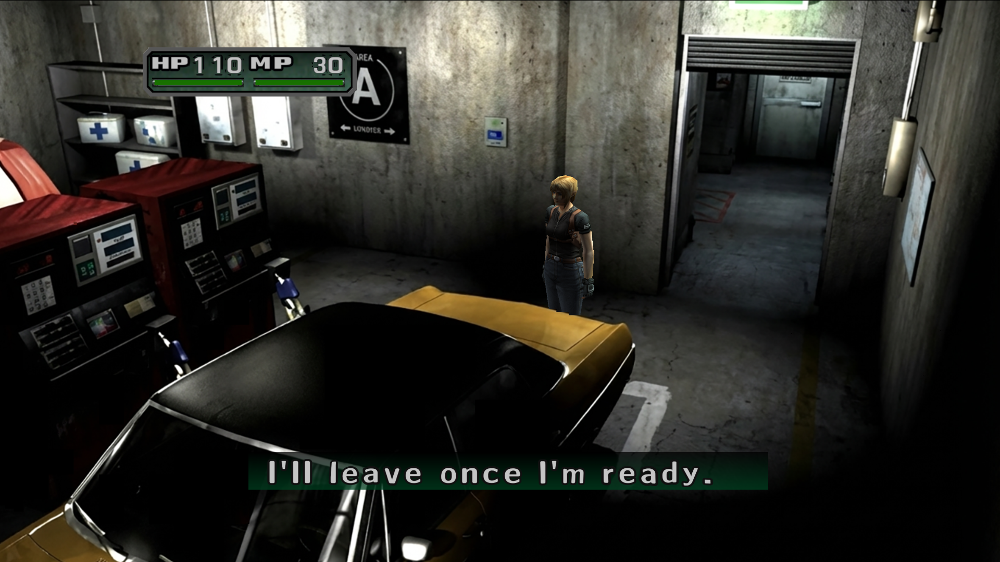
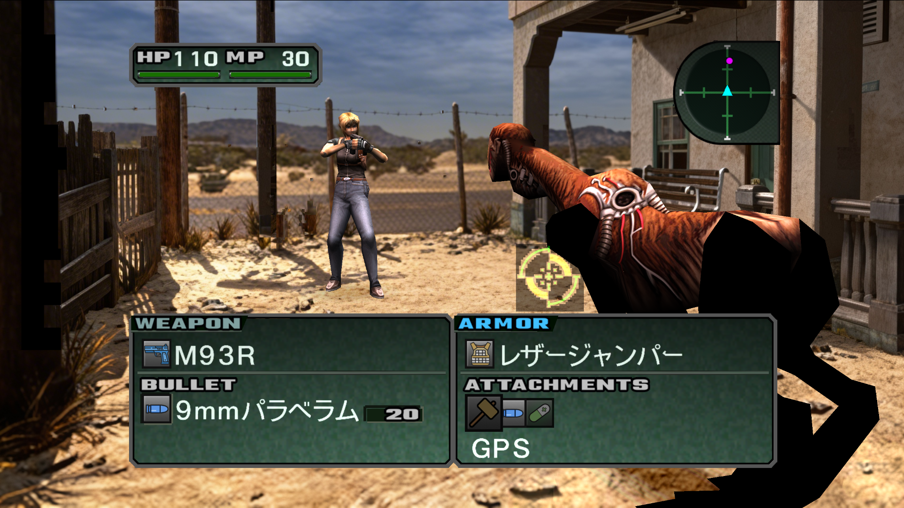

  

  <b>Una versión nativa para PC de Parasite Eve II, reconstruida a partir del juego original de PlayStation y remasterizada en alta definición.</b>

  
  
  

  <a href="README.md">🇬🇧 Read in English</a>

   
  <a href="https://streamable.com/nypzbk"><b>▶ Ver el vídeo de gameplay (8 min)</b></a>

---

## Sobre el proyecto

**Parasite Eve II HD Remaster** trae el clásico survival horror de Square del año 2000 a los PC actuales.

**No es un emulador.** El código original del juego de PlayStation se ha recompilado estáticamente en un ejecutable
nativo de Windows, lo que permite mejorar el juego desde dentro: modelos 3D nítidos, geometría estable, fondos
prerrenderizados en alta resolución y un pack de texturas completamente remasterizado.

Este repositorio es la **casa pública del proyecto**: novedades, capturas y progreso. No contiene código fuente,
ejecutables ni datos del juego.

> ⭐ Dale una **estrella** y pulsa 👁️ **Watch** para seguir el desarrollo.

---

## Capturas

<table>
  <tr>
    <td></td>
    <td></td>
    <td></td>
  </tr>
  <tr>
    <td></td>
    <td></td>
    <td></td>
  </tr>
  <tr>
    <td></td>
    <td></td>
    <td></td>
  </tr>
</table>

## Antes y después

<table>
  <tr>
    <td align="center"> <b>Fondos</b></td>
    <td align="center"> <b>Personajes</b></td>
  </tr>
  <tr>
    <td align="center"> <b>Menús y HUD</b></td>
    <td align="center"> <b>Geometría (PGXP)</b></td>
  </tr>
</table>

## Menús dentro del juego

Los dos menús se dibujan con los paneles, marcos, letras y cursor del propio juego, para que parezcan parte del original.

<table>
  <tr>
    <td align="center" width="50%"> <b>Opciones del Remaster</b> Se abre desde <b>Opciones</b> en el menú principal</td>
    <td align="center" width="50%"> <b>Estados guardados</b> <b>SELECT + R1</b> en el mando</td>
  </tr>
</table>

## Panorámico

Modo 16:9 opcional: la escena ocupa toda la pantalla y el HUD, los cuadros de texto y los menús se quedan exactamente donde estaban.

<table>
  <tr>
    <td></td>
    <td></td>
    <td></td>
  </tr>
</table>

## Texto en HD

<table>
  <tr>
    <td align="center" width="50%"> <b>Letras de los diálogos en HD</b></td>
    <td align="center" width="50%"> <b>Menús y nombres de objetos en japonés en HD</b></td>
  </tr>
</table>

---

## Características

### 🖥️ Versión nativa para PC
- **Recompilación estática** del juego original en un ejecutable nativo de Windows. Sin emulador.
- **Renderizado a alta resolución interna** para modelos 3D nítidos, hasta **4K**.
- **Precisión de geometría PGXP**: se acabaron los polígonos que tiemblan y las texturas que se deforman, y un
  recorte de polígonos preciso para que los personajes lejanos no pierdan triángulos.
- **Juego a 60 FPS** (experimental): la lógica sigue a sus 30 FPS originales, pero el renderizador compone un
  fotograma intermedio con cada polígono 3D a medio camino entre dos fotogramas del juego. Personajes y enemigos se
  mueven a 60 FPS sin retraso añadido; texto, HUD, vídeos y cambios de cámara quedan intactos.
- **Antialiasing FXAA** sobre la imagen del juego, sin emborronar textos, menús ni vídeos.
- **Panorámico 16:9** (opcional): la escena 4:3 se amplía hasta llenar la pantalla, recortando un poco arriba y
  abajo, y cada cámara tiene su propio encuadre para que no se corten cabezas ni pies. El HUD, los cuadros de texto,
  el menú de pausa y la pantalla de examinar objetos conservan su sitio y tamaño 4:3, y los 60 FPS siguen
  funcionando. El modo 4:3 queda intacto.
- **Un solo lanzador**: basta con abrir `pe2.exe`. El idioma elegido decide qué motor se ejecuta, así que el menú de
  opciones siempre corresponde al juego que estás jugando.

### ⚙️ Menú de opciones del Remaster
- Se abre desde **Opciones** en el menú principal, antes de empezar a jugar.
- **Modo Original**: el juego tal cual era en PlayStation, con filtro nítido o suave para texturas y vídeos.
  **Modo HD**: todas las mejoras activadas.
- Resolución interna (**Original, HD, Full HD, 4K**), texturas HD, vídeos HD, FXAA, scanlines, 60 FPS, pantalla
  completa y tamaño de ventana.
- **Cargas rápidas** en modo HD: puertas y cambios de cámara cargan en una fracción del tiempo, con la música y las
  cinemáticas sincronizadas, y las **pantallas "Now Loading" duran unos 3 segundos en vez de 8**.
- **Panorámico** activado o desactivado.
- Si un cambio necesita reiniciar, el juego **lo guarda y se reinicia solo**.
- **Dibujado en seis idiomas**: el menú se traduce al vuelo mientras eliges el idioma. Su tipografía se genera a
  partir de las fuentes Teko, Rajdhani, Barlow y Noto Sans JP, con los botones de PlayStation a color, y cada
  acción tiene su propio sonido.

### 🎮 Controles modernos
- **Stick izquierdo: controles modernos.** Aya anda hacia donde empujas, respecto a la cámara, como en el remake
  de *Resident Evil*. Los giros son instantáneos, con el stick a tope corre y, cuando la cámara cambia de plano, se
  mantiene la dirección hasta que muevas el stick, así que nunca se da la vuelta en un cambio de escena.
- **Cruceta: controles clásicos de tanque**, intactos. Los dos funcionan a la vez, sin nada que configurar.
- **También en combate**: con el arma lista, el stick mueve a Aya al instante; al soltarlo, el autoapuntado del
  propio juego la vuelve a girar hacia el objetivo fijado, lista para disparar. Empezar a andar, correr o bajar el
  arma ya no espera a los fundidos largos de animación.

### ⚡ Potenciadores
Inspirados en los potenciadores de comodidad que Square Enix añadió a las reediciones modernas de clásicos como
**FINAL FANTASY VII**. Se activan en cualquier momento con el mando y cada potenciador activo queda en pantalla como un
icono en la esquina superior derecha.

<table>
  <tr>
    <td align="center" width="33%"> <b>Velocidad x4</b> Mantén <b>L2</b> (o Tab en el teclado)</td>
    <td align="center" width="33%"> <b>HP infinita</b> <b>SELECT + ✕</b></td>
    <td align="center" width="33%"> <b>MP infinita</b> <b>SELECT + □</b></td>
  </tr>
</table>

Además: **SELECT + △** mantiene los BP al máximo y **SELECT + ○** mantiene la EXP en 6000 para mejorar a Aya.

### 💾 Estados guardados y disco único
- **Menú de estados guardados** con 12 ranuras, miniatura y fecha de cada una (**SELECT + R1**).
- **Un solo disco**: los dos discos se juegan como un único juego. Cuando la historia pasa al disco 2, o continúas
  desde el título una partida del disco 2, el disco se cambia al instante y la pantalla de cambio de disco no aparece.
- **Salir** en el menú de pausa cierra el juego.

### 🌍 Un solo juego, seis idiomas
- **Inglés, castellano, francés, alemán, italiano y japonés**, elegidos desde el menú de opciones del Remaster. El juego
  se reinicia solo en el idioma elegido.
- Cada idioma usa el **texto oficial de su propia edición de PlayStation**: los diálogos con la tipografía de cada
  idioma, las fichas de objetos y armas, los mensajes de la tarjeta de memoria y las etiquetas de los menús. Las pocas
  etiquetas que las localizaciones originales dejaron en inglés también se han traducido, incluidas las de las fichas
  de armas (RATE, RANGE…) y los nombres de las Energías Parásitas, abreviadas donde el hueco original es pequeño.
- **Japonés: un segundo motor construido sobre la edición japonesa**, con sus menús, fichas y diálogos nativos.
  Al elegir japonés se cambia de motor solo; los dos motores comparten la tarjeta de memoria, el pack HD y todas las
  mejoras.
- **Texturas HD por idioma**: cualquier imagen del pack puede tener una versión para cada idioma, así que la pantalla
  de título sale traducida y todas las regiones muestran la misma pantalla de editora antes de la intro.
- No se modifica nada de los discos: cada idioma es un pequeño paquete generado desde la edición de esa región y
  aplicado en memoria mientras el juego funciona.
- Los mensajes en pantalla (guardado, velocidad, modo ventana) salen en una ventana con el estilo del propio juego.

### 🎨 Remasterización HD
- **Fondos prerrenderizados en HD** a 1440×1080, incluidos los que se cargan por tiras durante las escenas del juego.
- **Los cuadros de texto, las transiciones de puertas, las sacudidas de pantalla y el destello de entrada al combate se
  mantienen en HD.** El juego original congelaba la pantalla a 320×240 en todos esos casos; la remasterización
  conserva la resolución completa.
- **Capas de primer plano en HD** generadas a partir de los fondos HD, para que los objetos delante de los personajes
  coincidan con el nuevo arte.
- **Texturas remasterizadas** de personajes, enemigos, armas, HUD y menús.
- **Letras de los diálogos en HD en los seis idiomas**: cada letra de los cuadros de diálogo y de los carteles con el
  nombre de quien habla se redibuja en alta resolución, por idioma, y conserva los colores del propio juego (blanco,
  verde de selección, texto rojo y azul). Los alfabetos latinos usan la tipografía CMU Sans Serif; el japonés usa
  Noto Sans JP, inclinada como la original.
- **Texto japonés en HD**: cada kanji se identificó leyendo cada frase en su contexto y se comprobó con la forma de la
  letra original; los pocos que no se pudieron confirmar conservan un reescalado limpio, así que nunca aparece un
  carácter equivocado. La fuente japonesa de menús, tienda y objetos también está remasterizada.
- **Cinemáticas en alta resolución**: cada fotograma de los FMV se reconoce mientras el juego lo decodifica y se
  sustituye por su versión en alta resolución (por ejemplo, reescalada con IA), así que los vídeos conservan el audio y
  el ritmo del propio juego y nunca se desincronizan. Los vídeos originales siguen disponibles desde el menú de opciones.
- **Compatible con packs de texturas de DuckStation**: los reemplazos `texpage-*` y `vram-write-*` funcionan tal cual.
- **Pensado para quien hace texturas**: los reemplazos se llaman como los ficheros del propio juego (fondos
  `bs_N.png`, imágenes `pe2img_N.png`), el pack **se recarga con el juego abierto** (guardas un PNG y lo ves al
  instante), y una galería en color de todas las imágenes del disco más una herramienta que identifica los volcados de
  DuckStation llevan la cuenta de lo hecho, lo que está en proceso y lo que falta.

---

## Hoja de ruta

| Estado | Característica |
|:---:|---|
| ✅ | Ejecutable nativo de Windows (recompilación estática) |
| ✅ | Renderizado a alta resolución (hasta 4K) y precisión de geometría PGXP |
| ✅ | Motor de reemplazo de fondos HD |
| ✅ | Cuadros de texto, pantallas congeladas, sacudidas y destello de combate en HD |
| ✅ | Motor de reemplazo de texturas HD (por imagen del juego, por paleta, compatible con DuckStation) |
| ✅ | Capas de primer plano HD automáticas |
| ✅ | **Letras de los diálogos en HD** en inglés, castellano, francés, alemán, italiano y japonés |
| ✅ | Menús, tienda y nombres de objetos japoneses en HD |
| ✅ | **Panorámico 16:9** (opcional), con el HUD y los menús en 4:3 |
| ✅ | Pantallas "Now Loading" más rápidas (unos 3 s en vez de 8) |
| ✅ | Un solo lanzador que elige el motor según el idioma |
| ✅ | Texturas HD por idioma (pantalla de título traducida) |
| ✅ | Juego a **60 FPS** por interpolación de polígonos (experimental) |
| ✅ | Recorte de polígonos preciso (PGXP) |
| ✅ | Antialiasing FXAA |
| ✅ | **Seis idiomas**: inglés, castellano, francés, alemán, italiano y diálogos en japonés |
| ✅ | **Motor japonés** con menús nativos (segundo ejecutable, misma carpeta) |
| ✅ | **Controles modernos** en el stick (respecto a la cámara) junto a los clásicos en la cruceta |
| ✅ | Menú del Remaster en seis idiomas con tipografía y sonidos nuevos |
| 🔜 | Instalador que construye el juego desde tus propios discos, para no distribuir nunca datos del juego |
| ✅ | **Menú de opciones del Remaster** con modos Original y HD |
| ✅ | **Potenciadores**: velocidad x4, HP y MP infinitas, BP y EXP al máximo |
| ✅ | **Menú de estados guardados** con miniaturas |
| ✅ | **Un solo disco** (sin pantalla de cambio de disco) |
| ✅ | Cargas rápidas en puertas y cambios de cámara |
| ✅ | Recarga en caliente del pack HD y texturas con nombres del disco |
| 🚧 | Completar el pack de fondos HD |
| 🚧 | Personajes, enemigos y armas remasterizados |
| 🚧 | HUD, menús e iconos de objetos remasterizados |
| ✅ | Motor de **cinemáticas en alta resolución** (FMV sustituidos fotograma a fotograma, siempre sincronizados) |
| 🚧 | Reescalado de todos los FMV a alta resolución |
| 🔜 | Lanzamiento público |

### Progreso del pack HD

| Recurso | Remasterizados | Total | Progreso |
|---|---:|---:|---|
| Fondos prerrenderizados | 1.328 | 1.759 |  |
| Imágenes del juego (personajes, HUD, menús, primeros planos) | 864 | 1.453 |  |

---

## Novedades

**17-09-2026 — Panorámico, texto HD en todos los idiomas y un solo lanzador**
- **Panorámico 16:9**, como opción del menú del Remaster. La escena 4:3 se amplía hasta llenar la pantalla y cada
  cámara tiene su propio encuadre, para que los personajes no pierdan la cabeza ni los pies. El HUD, los cuadros de
  texto, el menú de pausa, la pantalla de examinar objetos y los efectos se quedan en su sitio y tamaño 4:3, y el
  modo a 60 FPS sigue funcionando. Con la opción desactivada, el juego se ve exactamente como antes.
- **Letras HD terminadas** en castellano, francés, alemán e italiano, y ahora también en **japonés**: cada carácter
  de los diálogos se identificó leyendo cada frase en su contexto y se comprobó después con la forma de la letra
  original. Las que no se pudieron confirmar conservan un reescalado limpio en vez de arriesgar un kanji equivocado.
  Los carteles de nombre japoneses y la fuente de menús, tienda y objetos también están en HD.
- **"Now Loading" más rápido**: esas pantallas duran ahora unos 3 segundos en vez de 8.
- **Traducciones completadas**: etiquetas de las fichas de armas (RATE, RANGE…), nombres de las Energías Parásitas
  y algunas etiquetas de menú que seguían en inglés, abreviadas donde el hueco original es pequeño. La ayuda de Salir
  indica ahora que cierra el juego.
- **Un solo lanzador**: solo hay que abrir `pe2.exe`; el idioma elegido decide qué motor se ejecuta, y el motor
  japonés vive ahora en su propia carpeta `engine`.
- **Texturas HD por idioma**: el pack puede guardar una versión de cualquier imagen para cada idioma, que se usa para
  la pantalla de título traducida, y todas las regiones muestran ya la misma pantalla de editora antes de la intro.

**16-09-2026 — Letras de los diálogos en HD**
- Las letras de los cuadros de diálogo y los carteles con el nombre de quien habla se dibujan ahora en **alta
  resolución**. Cada sala trae su propio atlas de letras; el Remaster reconoce cada letra mientras el juego la
  dibuja y la sustituye por una versión nítida trazada con la tipografía **CMU Sans Serif**, ajustada al tamaño y
  la posición exactos de la original para que el texto no se descoloque. Las paletas del juego se aplican en
  directo, así que el texto blanco, verde, rojo y azul y los carteles de nombre mantienen sus colores.
- Cada idioma tiene su propio juego de letras, con sus acentos y signos (¡ ¿ ñ é ß ä ö ü « » …), y solo se usa
  el del idioma con el que juegas.
- El inglés está terminado; castellano, francés, alemán e italiano están generados y en pruebas. Después, el
  japonés.

**16-09-2026 — Controles modernos, motor japonés y nuevo menú del Remaster**
- **Controles modernos**: el stick izquierdo mueve a Aya respecto a la cámara, como en el remake de *Resident
  Evil*, con giros instantáneos y carrera con el stick a tope; en un cambio de plano se mantiene la dirección hasta
  que muevas el stick. La cruceta conserva los controles clásicos de tanque y los dos funcionan a la vez. También
  en combate: el stick mueve a Aya con el arma lista y, al soltarlo, el autoapuntado del juego la devuelve al
  objetivo. Los fundidos de animación al empezar a andar, correr o bajar el arma se han acortado para que responda
  al momento.
- **Motor japonés**: la edición japonesa funciona ya como un segundo motor con sus menús, fichas y diálogos nativos
  y todas las mejoras del proyecto (pack HD, cinemáticas, 60 FPS, disco único, potenciadores). Al elegir japonés en
  el menú de opciones se cambia de motor automáticamente; los dos comparten carpeta y tarjeta de memoria.
- **Menú del Remaster rehecho**: el idioma en primer lugar y traducido al vuelo mientras lo eliges, tipografía nueva
  generada desde las fuentes Teko, Rajdhani, Barlow y Noto Sans JP, botones de PlayStation, marcos limpios y sonidos
  al abrir, moverse, elegir y guardar. El menú de estados guardados y los mensajes en pantalla siguen el idioma
  elegido.

**16-09-2026 — Seis idiomas en un solo juego**
- El proyecto pasa a tener como base la **edición americana**, y sobre ella se importan los demás idiomas:
  **castellano, francés, alemán, italiano** y **japonés**, elegidos desde el menú de opciones del Remaster.
- Cada idioma trae el **texto oficial de su propia edición de PlayStation**: los diálogos, con la tipografía de cada
  idioma, las fichas de objetos y armas, los mensajes de la tarjeta de memoria y las etiquetas de los menús. Donde las
  localizaciones originales dejaron etiquetas en inglés, también se han traducido. Unas pocas salas cuya lógica de
  diálogos cambia entre regiones usan la lógica americana con el texto localizado, así que no queda nada sin traducir.
- Los **diálogos japoneses** no cabían en el disco americano (la tipografía de kanji ocupa dos o tres veces más), así
  que las imágenes de letras se entregan directamente a la memoria de vídeo mientras el juego carga cada sala. Los menús
  y fichas japoneses usan otro motor de texto; ha empezado una versión dedicada sobre el ejecutable japonés.
- Por dentro: el motor de traducción recorre cada módulo cargado una sola vez en vez de una por texto, lo que elimina
  los tirones en las pantallas de carga; y cargar una partida con un idioma traducido, que se quedaba en "Now loading",
  está arreglado.

**15-09-2026 — Menú de opciones del Remaster, potenciadores, estados guardados y un solo disco**
- **Menú de opciones del Remaster** dentro del juego, desde Opciones en el menú principal y con el estilo del propio
  juego: modo Original o HD, resolución hasta 4K, texturas y vídeos HD, FXAA, scanlines, 60 FPS y opciones de ventana.
  El juego se reinicia solo para aplicar los cambios que lo necesitan.
- **Potenciadores** inspirados en las reediciones de Square Enix como FINAL FANTASY VII: mantén L2 para jugar a
  velocidad x4 y activa HP infinita, MP infinita, BP y EXP al máximo con SELECT y los botones de acción. Los
  potenciadores activos se muestran como iconos.
- **Menú de estados guardados** rediseñado con el aspecto del juego: 12 ranuras con miniatura y fecha.
- **Un solo disco**: el runtime cambia de disco por su cuenta antes de que el juego lo pida, así que la pantalla de
  cambio de disco desaparece, también al continuar una partida del disco 2 o al cargar un estado guardado.
- **Cinemáticas en alta resolución**: los FMV se sustituyen fotograma a fotograma por su versión en alta resolución
  mientras el juego sigue reproduciendo su propio audio, así que van perfectamente sincronizados.
- **HD en todas partes**: antialiasing FXAA, el destello en blanco y negro al empezar el combate y las sacudidas de
  pantalla de los jefes conservan la resolución completa, y las cinemáticas siguen sincronizadas con las cargas rápidas
  de puertas y cámaras.

**14-09-2026 — 60 FPS, recorte preciso, menús en castellano y herramientas**
- **Juego a 60 FPS** (experimental). Forzar el juego a 60 lo ponía al doble de velocidad, así que el renderizador graba
  todos los polígonos de cada fotograma y compone uno intermedio con la geometría 3D a medio camino entre dos
  fotogramas. Empareja los polígonos por sus coordenadas de textura, deja quietos el texto y el UI, y se desactiva solo
  en cambios de cámara, cargas, pantallas congeladas y vídeos. Sin retraso añadido en los mandos.
- **Recorte preciso**: los personajes lejanos perdían triángulos porque la PlayStation decide la visibilidad con
  coordenadas enteras. El GTE conserva ahora la precisión subpíxel a través de las recargas de vértices del propio
  juego, y cada decisión de recorte se toma con ella.
- **Menús y fichas en castellano**: las últimas cadenas en inglés (etiquetas de menú, fichas de munición y
  protecciones) se traducen en memoria y al vuelo cuando se leen del disco, sin tocar los ficheros del juego.
- **Para quien hace texturas**: el pack HD se divide ahora en *final*, *en proceso* y *faltantes*, los ficheros usan
  los nombres del disco y el juego recarga cualquier PNG en cuanto se guarda.

---

## Preguntas frecuentes

**¿Se puede descargar?**
Todavía no. El proyecto está en desarrollo activo. Sigue este repositorio para enterarte del primer lanzamiento.

**¿Necesitaré el juego original?**
Sí. Necesitarás tu propia copia legal de *Parasite Eve II* para PlayStation. Nunca se distribuirán datos del juego.

**¿Es un emulador?**
No. El código del juego se ejecuta de forma nativa en tu PC tras recompilarse a partir del ejecutable original de PlayStation.

**¿Está disponible el código fuente?**
Por ahora no.

---

## Créditos

Este proyecto se apoya en estos proyectos y personas increíbles:

| Proyecto | Autor | Para qué se usa | Licencia |
|---|---|---|---|
| [PSXRecomp](https://github.com/mstan/psxrecomp) | Matthew Stan | El recompilador estático de PlayStation y el runtime fiel al hardware sobre el que se construye esta versión | PolyForm Noncommercial 1.0.0 |
| [Descompilación de Parasite Eve II](https://github.com/GabeRealB/parasite-eve-2-decomp) | GabeRealB y colaboradores | Formatos de archivo del juego, herramientas de extracción, símbolos y nombres de salas | CC0 1.0 |
| [DuckStation](https://github.com/stenzek/duckstation) | Stenzek | Referencia para los nombres de reemplazo de texturas y la decodificación MDEC, para que los packs de DuckStation funcionen tal cual | CC BY-NC-ND 4.0 |
| [Beetle PSX](https://github.com/libretro/beetle-psx-libretro) | libretro, basado en Mednafen | Referencia de precisión usada por PSXRecomp | GPL-2.0 |
| PGXP | iCatButler | Técnica original de precisión de geometría | — |
| FXAA | Timothy Lottes (NVIDIA) | Técnica original de antialiasing aproximado rápido | — |
| [PlayStation Specifications (psx-spx)](https://psx-spx.consoledev.net/) | Martin "nocash" Korth y colaboradores | Documentación del hardware y de los contenedores de archivos | — |
| [Teko](https://github.com/googlefonts/teko), [Rajdhani](https://github.com/itfoundry/rajdhani), [Barlow](https://github.com/jpt/barlow), [Noto Sans JP](https://github.com/notofonts/noto-cjk) | Indian Type Foundry, Jeremy Tribby, Google y Adobe | Tipografía de los menús del Remaster | SIL OFL 1.1 |
| [CMU Sans Serif](https://cm-unicode.sourceforge.io/) | Donald Knuth (Computer Modern), Andrey V. Panov (CM-Unicode) | Letras HD de los diálogos | SIL OFL 1.1 |
| Herramienta de sustitución de fuentes | u/Over_Transition_8907 | Idea original de las letras HD y referencia de glifos para identificar las letras del juego | — |
| [Icono del juego](https://www.steamgriddb.com/) | Ghoulrx (SteamGridDB) | Icono del ejecutable del juego | — |

Librerías: [SDL3](https://libsdl.org), [xxHash](https://github.com/Cyan4973/xxHash) (Yann Collet),
[stb_image](https://github.com/nothings/stb) (Sean Barrett), [libchdr](https://github.com/rtissera/libchdr) y [zlib](https://zlib.net).

Pack HD Remaster y proyecto: **faligame**.

---

## Aviso legal

Este es un proyecto fan sin ánimo de lucro y no está afiliado, respaldado ni patrocinado por Square Enix.
*Parasite Eve*, *Parasite Eve II* y *FINAL FANTASY VII* son marcas registradas de Square Enix Co., Ltd. Todo el contenido del juego pertenece a sus respectivos propietarios.
Este repositorio no contiene ni distribuirá nunca archivos del juego, BIOS ni recursos del juego protegidos por derechos de autor.
